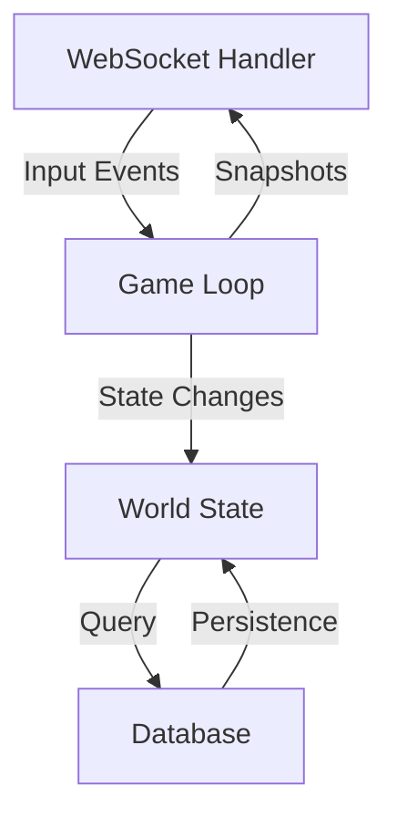
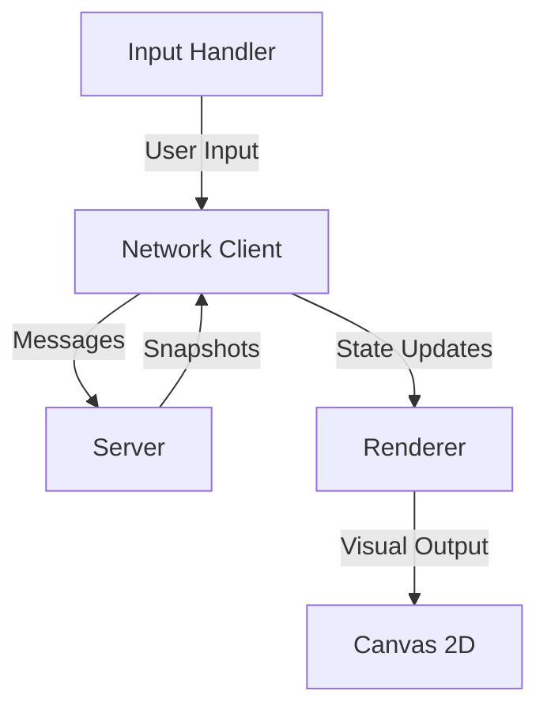

# Architecture Overview

This directory contains documentation about the system's architecture and design principles.

## Current Structure

```
architecture/
└── README.md          # This file (architecture overview)
```

## Core Architectural Principles

### Server-Authoritative Design
- **Single Source of Truth**: The Rust server is the authoritative source for all game state
- **Client Role**: Clients are "dumb renderers + input devices" with no gameplay authority
- **Trust Boundary**: All client inputs are validated server-side before processing

### Deterministic Simulation
- **Fixed Tick Loop**: Game simulation runs at a fixed rate (typically 20-60 Hz)
- **State Ownership**: Single game loop task owns world state
- **Event Processing**: Input events are consumed from bounded channels
- **Snapshot Publishing**: Simulation state published to per-client outbound queues

### Component Architecture

#### Server Components


#### Client Components


## Key Architectural Decisions

### 1. Rust + PostgreSQL Only Runtime
**Decision**: Limit runtime processes to Rust server + PostgreSQL only
**Rationale**:
- Reduces operational complexity
- Minimizes attack surface
- Simplifies deployment and scaling
- Aligns with performance requirements

### 2. TypeScript Build-Time Compilation
**Decision**: Use TypeScript for client development but compile to JS at build-time
**Rationale**:
- Maintains type safety during development
- Eliminates runtime Node.js dependency
- Rust serves compiled static assets
- Simplifies production architecture

### 3. Fixed-Rate Simulation Loop
**Decision**: Use fixed-rate tick loop instead of variable frame rate
**Rationale**:
- Ensures deterministic simulation
- Simplifies network synchronization
- Provides consistent gameplay experience
- Easier to reason about game state

### 4. WebSocket Primary Transport
**Decision**: Use WebSocket for realtime gameplay communication
**Rationale**:
- Low-latency bidirectional communication
- Built-in connection management
- Efficient for frequent small messages
- Browser-native support

## Architecture Constraints

### Hard Constraints (Never Break)
1. **Runtime Processes**: Only Rust server + PostgreSQL
2. **No Long-Running Node**: Node.js only in build stages
3. **Server Authority**: Server is sole authority for gameplay state
4. **Directory Structure**: Follow strict root layout (docs/, src/, etc.)

### Soft Constraints (Preferred)
1. **File Size Limits**: ≤ 200 lines for source, ≤ 300 lines for docs
2. **Documentation**: Every directory has exactly one README.md TOC
3. **Testing**: Unit tests for deterministic logic, integration tests for key paths
4. **Performance**: Avoid pathological patterns, prefer boring solutions

## Component Interfaces

### Server-Client Interface
- **Protocol**: Binary protocol (preferred) or compact JSON
- **Message Structure**:
  ```typescript
  interface GameMessage {
    protocol_version: string;
    msg_type: string;
    seq: number;          // Client input sequence
    // ... message-specific payload
  }
  ```
- **Snapshot Structure**:
  ```typescript
  interface GameSnapshot {
    protocol_version: string;
    server_tick: number;  // For reconciliation
    // ... game state data
  }
  ```

### Server-Database Interface
- **Persistence Scope**: Accounts, sessions, progression, inventory
- **Non-Persistence**: High-frequency transient state, per-tick physics
- **Migration Strategy**: Reproducible migrations with versioning

### Client-Render Interface
- **Rendering Target**: Canvas 2D
- **Asset Strategy**: Minimal sprites/primitives, systemic depth focus
- **Performance Budget**: Prioritize mechanics over visual complexity

## Performance Considerations

### Simulation Performance
- **Tick Rate**: Target 20-60 Hz based on complexity
- **State Management**: Use ownership and channels, avoid global mutable state
- **Memory**: Bounded queues, capped growth patterns

### Network Performance
- **Message Size**: Minimize payload sizes
- **Rate Limiting**: Per-connection inbound message caps
- **Compression**: Consider for larger snapshots

### Database Performance
- **Query Optimization**: Minimize per-tick database operations
- **Caching**: Consider caching for frequently accessed data
- **Batch Operations**: Group database operations where possible

## Future Architecture Evolution

### Potential Enhancements
1. **Horizontal Scaling**: Region-based sharding for larger worlds
2. **Persistence Optimization**: Event sourcing for state changes
3. **Protocol Evolution**: Versioned protocol with backward compatibility
4. **Monitoring**: Enhanced metrics and observability

### Non-Goals (Current Phase)
1. **Perfect Anti-Cheat**: Baseline validation only
2. **Photorealistic Graphics**: Simple 2D visuals sufficient
3. **Multi-Region**: Single region deployment initially
4. **Backward Compatibility**: Breaking changes allowed during development

## Related Documentation

- **Protocol Details**: See `../protocol/README.md`
- **Gameplay Systems**: See `../gameplay/README.md`
- **Operational Setup**: See `../operations/README.md`
- **Architectural Decisions**: See `../decisions/README.md`