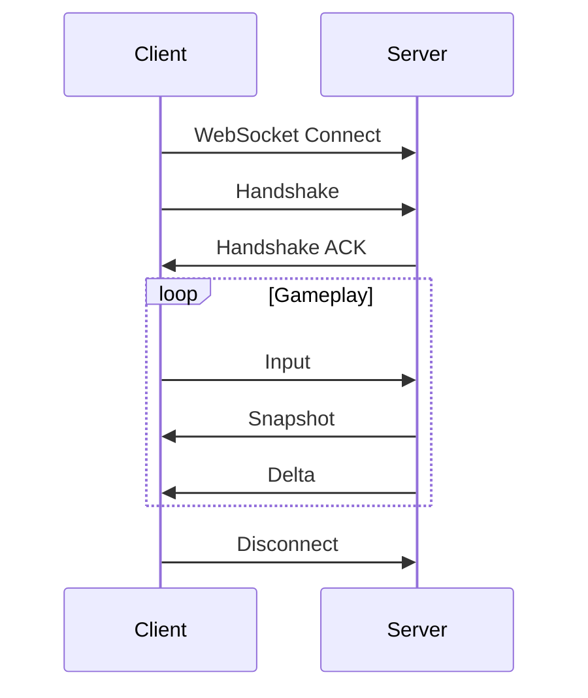

# Networking Architecture

## Transport Layer

### WebSocket Primary
- Bidirectional realtime communication
- Browser-native support
- Efficient for frequent small messages

### HTTP Fallback
- Initial handshake
- Static asset delivery
- REST endpoints for non-realtime operations

### Port Configuration
- HTTP: Typically 80/443
- WebSocket: Same or different port
- Configurable via environment variables

## Message Flow

### Connection Lifecycle

### Message Types
- `handshake`: Initial connection
- `input`: Player actions
- `snapshot`: Full state
- `delta`: State changes
- `event`: Game events
- `ping/pong`: Keep-alive

## Protocol Implementation

### Binary Protocol
- Custom binary format
- Fixed headers, variable payloads
- Little-endian byte order
- Schema versioned

### JSON Fallback
- Compact JSON
- No whitespace
- UTF-8 encoding
- Development only

## Performance Considerations

### Optimization Strategies
- Message batching
- Compression for large payloads
- Efficient serialization
- Connection pooling

### Rate Limiting
- Per-connection message caps
- Burst protection
- Abuse detection
