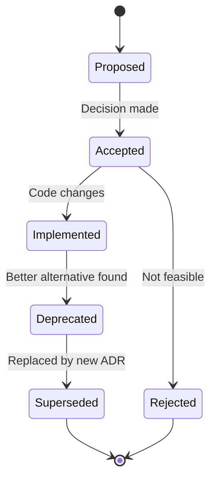
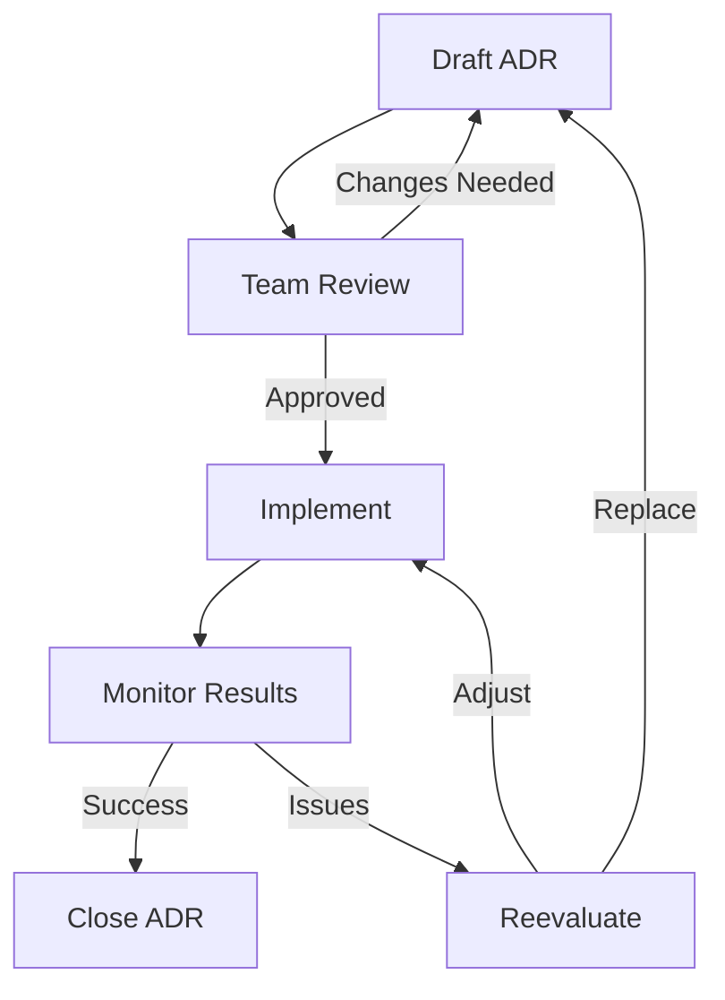
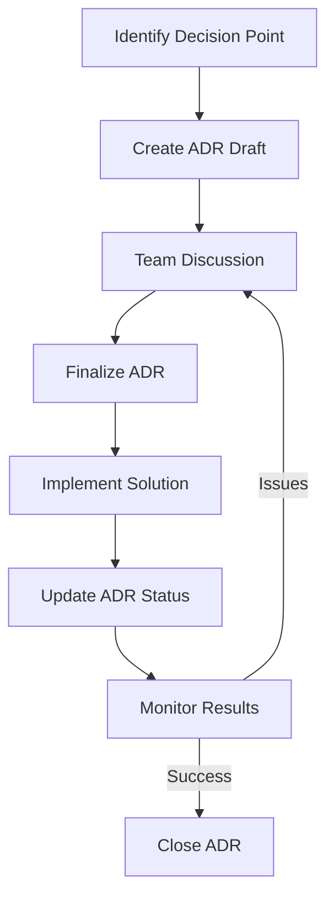

# Architectural Decision Records (ADRs)

This directory contains documentation of key architectural decisions for the project.

## Current Structure

```
decisions/
├── README.md                # This file (ADR overview)
└── adr-0001-template.md     # ADR template (example)
```

## ADR Process

### When to Create an ADR

Create an Architectural Decision Record when:

1. **Major Technology Choices**: Selecting core frameworks, languages, or platforms
2. **Design Trade-offs**: Significant architectural alternatives with different implications
3. **Breaking Changes**: Changes that affect multiple components or systems
4. **Performance Considerations**: Decisions impacting scalability or efficiency
5. **Security Implications**: Changes affecting the security model
6. **Long-term Maintenance**: Decisions with ongoing maintenance consequences

### ADR Lifecycle



### ADR Numbering

- Format: `adr-XXXX-description.md`
- Numbering: Sequential, zero-padded (0001, 0002, ...)
- Example: `adr-0001-rust-server-choice.md`

## ADR Template

```markdown
# ADR 000X: [Short Title]

**Status**: Proposed / Accepted / Implemented / Deprecated / Superseded
**Date**: YYYY-MM-DD
**Authors**: [Author Names]
**Last Updated**: YYYY-MM-DD

## Context

[Describe the problem or opportunity that led to this decision. Include:
- The issue being addressed
- Current limitations or pain points
- Business or technical requirements
- Relevant background information]

## Decision

[Clearly state the chosen solution or approach. Be specific about:
- What was decided
- Key characteristics of the solution
- Scope and boundaries]

## Alternatives Considered

### Alternative 1: [Name]
[Description of alternative, including:
- How it addresses the problem
- Pros and cons
- Why it wasn't chosen]

### Alternative 2: [Name]
[Description of alternative]

## Consequences

### Positive
- [Benefits of this decision]
- [Improvements over current state]
- [Future opportunities enabled]

### Negative
- [Drawbacks or trade-offs]
- [Potential risks]
- [Maintenance burdens]

### Neutral
- [Other impacts worth noting]

## Implementation

[Details about how this decision will be implemented:
- Components affected
- Migration strategy (if applicable)
- Timeline or milestones
- Testing approach]

## Related Decisions

- [ADR-XXXX: Related Decision]()
- [ADR-YYYY: Another Related Decision]()

## Future Considerations

[Things to watch for or revisit later:
- Metrics to monitor
- Conditions that might require reevaluation
- Potential future enhancements]

## References

- [Relevant documentation]()
- [External resources]()
- [Code examples or prototypes]()
```

## Existing ADRs

### Core Architecture Decisions

#### ADR-0001: Rust Server Choice
**Status**: Implemented
**Date**: 2024-01-15
**Decision**: Use Rust for the game server implementation

**Key Points**:
- Performance requirements for multiplayer simulation
- Memory safety without garbage collection
- Strong ecosystem for async networking
- Long-term maintainability

#### ADR-0002: PostgreSQL Database
**Status**: Implemented
**Date**: 2024-01-15
**Decision**: Use PostgreSQL as the primary database

**Key Points**:
- Reliability and data integrity
- Strong JSON support for flexible schemas
- Good performance for our access patterns
- Familiar to team members

#### ADR-0003: WebSocket Primary Transport
**Status**: Implemented
**Date**: 2024-01-16
**Decision**: Use WebSocket for realtime gameplay communication

**Key Points**:
- Low-latency bidirectional communication
- Browser-native support
- Efficient for frequent small messages
- Simpler than TCP with custom protocol

#### ADR-0004: Fixed-Rate Simulation Loop
**Status**: Implemented
**Date**: 2024-01-17
**Decision**: Implement fixed-rate tick loop instead of variable frame rate

**Key Points**:
- Deterministic simulation behavior
- Consistent gameplay experience
- Easier network synchronization
- Better for physics calculations

### Gameplay System Decisions

#### ADR-0005: Server-Authoritative Architecture
**Status**: Implemented
**Date**: 2024-01-18
**Decision**: Server is sole authority for all gameplay state

**Key Points**:
- Prevents client-side cheating
- Consistent game state across clients
- Simpler conflict resolution
- Better for competitive gameplay

#### ADR-0006: Hunger as Mandatory Survival Mechanic
**Status**: Implemented
**Date**: 2024-01-19
**Decision**: Hunger system is mandatory, thirst/thirst optional

**Key Points**:
- Core survival experience requires food gathering
- Thirst adds complexity but not essential
- Temperature system deferred for simplicity

#### ADR-0007: Crafting Progression Model
**Status**: Implemented
**Date**: 2024-01-20
**Decision**: Tiered crafting stations with recipe unlocks

**Key Points**:
- Encourages exploration and resource gathering
- Provides clear progression path
- Balances early vs late game content

### Technical Implementation Decisions

#### ADR-0008: Binary Protocol Format
**Status**: Proposed
**Date**: 2024-01-21
**Decision**: Use custom binary protocol instead of JSON for production

**Key Points**:
- Better performance and bandwidth
- Smaller message sizes
- More efficient parsing
- JSON fallback for development

#### ADR-0009: TypeScript Build Pipeline
**Status**: Implemented
**Date**: 2024-01-22
**Decision**: TypeScript for client with build-time compilation

**Key Points**:
- Type safety during development
- No runtime Node.js dependency
- Rust serves compiled assets
- Better tooling and ecosystem

#### ADR-0010: Docker Deployment Model
**Status**: Implemented
**Date**: 2024-01-23
**Decision**: Containerized deployment with Docker Compose

**Key Points**:
- Consistent development and production environments
- Easy dependency management
- Simplified deployment process
- Good isolation properties

## ADR Management

### Creating a New ADR

```bash
# 1. Find next available number
ls decisions/adr-*.md | sort -r | head -1

# 2. Create new ADR file
cp decisions/adr-0001-template.md decisions/adr-0011-new-decision.md

# 3. Edit the new ADR
# - Update title and metadata
# - Fill in context and decision
# - Document alternatives and consequences

# 4. Commit the ADR
git add decisions/adr-0011-new-decision.md
git commit -m "docs(adrs): add ADR-0011 about new decision"
```

### Updating an ADR

```bash
# 1. Edit the ADR file
# - Update status if changed
# - Add new information
# - Update last modified date

# 2. Commit the changes
git add decisions/adr-XXXX-updated.md
git commit -m "docs(adrs): update ADR-XXXX status to Implemented"
```

### Deprecating an ADR

```bash
# 1. Create new ADR that supersedes the old one
# 2. Update old ADR status to "Deprecated"
# 3. Add reference to superseding ADR
# 4. Commit both changes together
```

## ADR Review Process

### Review Checklist

1. **Clarity**: Is the problem clearly stated?
2. **Alternatives**: Are reasonable alternatives considered?
3. **Consequences**: Are pros and cons well documented?
4. **Implementation**: Is the implementation plan realistic?
5. **Future**: Are future considerations addressed?
6. **References**: Are relevant resources linked?

### Review Workflow



## ADR Best Practices

### Writing Effective ADRs

1. **Be Specific**: Clearly define the problem and solution
2. **Stay Focused**: Address one decision per ADR
3. **Document Rationale**: Explain why this decision was made
4. **Consider Alternatives**: Show that options were evaluated
5. **Think Long-term**: Document future implications
6. **Keep Updated**: Reflect the current state accurately

### Maintaining ADRs

1. **Regular Reviews**: Periodically review active ADRs
2. **Update Status**: Keep status current with implementation
3. **Link Related**: Connect related decisions
4. **Archive Old**: Remove deprecated ADRs when superseded
5. **Searchable**: Use consistent naming and tags

## ADR Tools and Integration

### Version Control Integration

- Store ADRs in version control with code
- Reference ADRs in commit messages
- Link ADRs to relevant code changes

### Documentation Integration

- Link ADRs from relevant README files
- Reference ADRs in architecture documentation
- Connect ADRs to protocol specifications

### Development Workflow



## Future ADR Topics

### Potential Future Decisions

1. **Scaling Strategy**: How to handle growth beyond single server
2. **Persistence Model**: Event sourcing vs current state model
3. **Anti-Cheat Systems**: Beyond basic validation
4. **Content Delivery**: Asset distribution strategy
5. **Localization**: Multi-language support approach

### Deferred Decisions

1. **Mobile Client Support**: Native apps vs web progressive app
2. **Modding System**: Plugin architecture for user content
3. **Cross-Platform Play**: Console integration strategy
4. **Monetization Model**: Cosmetics, expansions, subscriptions
5. **Community Features**: Clan systems, tournaments, etc.

## Related Documentation

- **Architecture Overview**: See `../architecture/README.md`
- **Protocol Specifications**: See `../protocol/README.md`
- **Gameplay Systems**: See `../gameplay/README.md`
- **Operations Guide**: See `../operations/README.md`