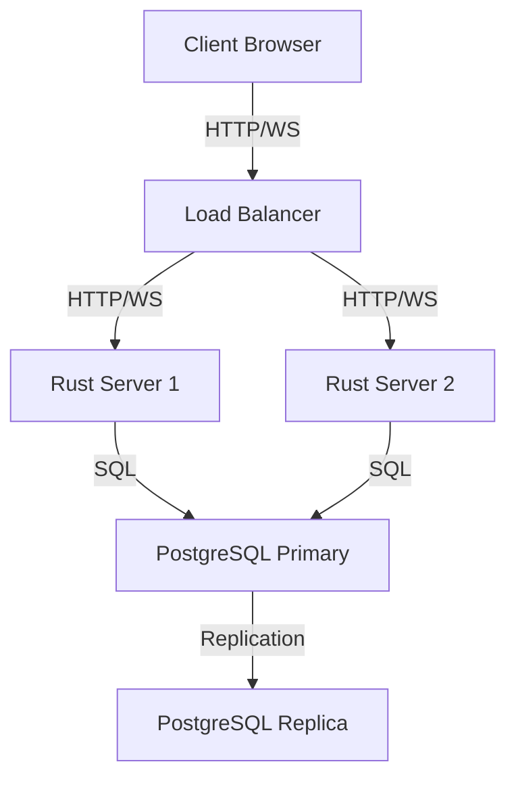
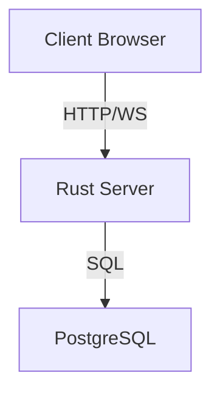
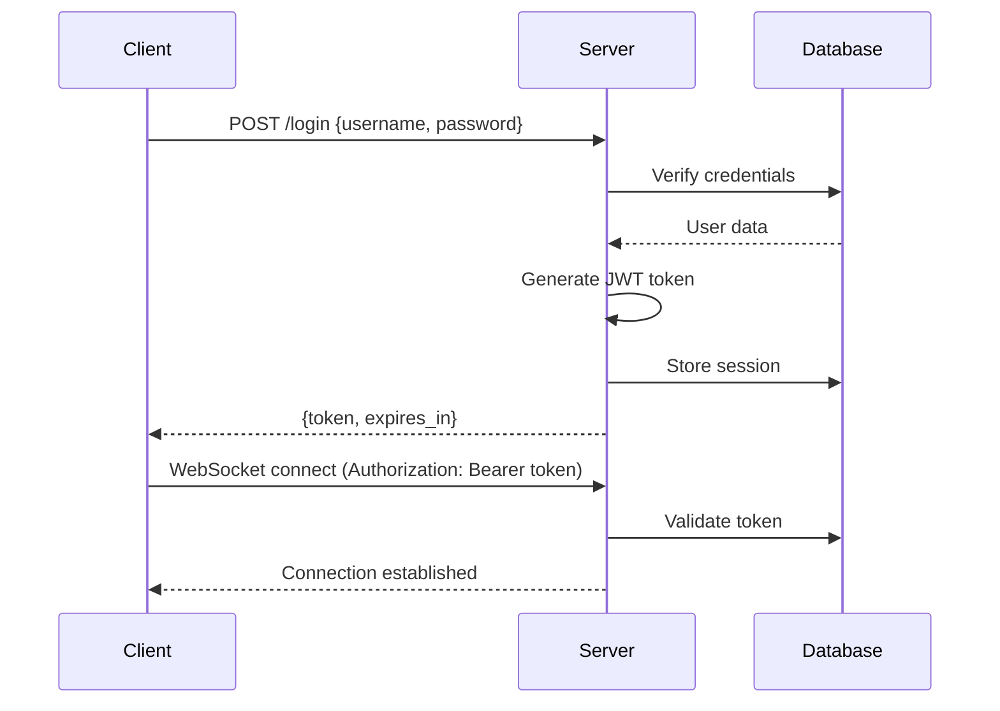
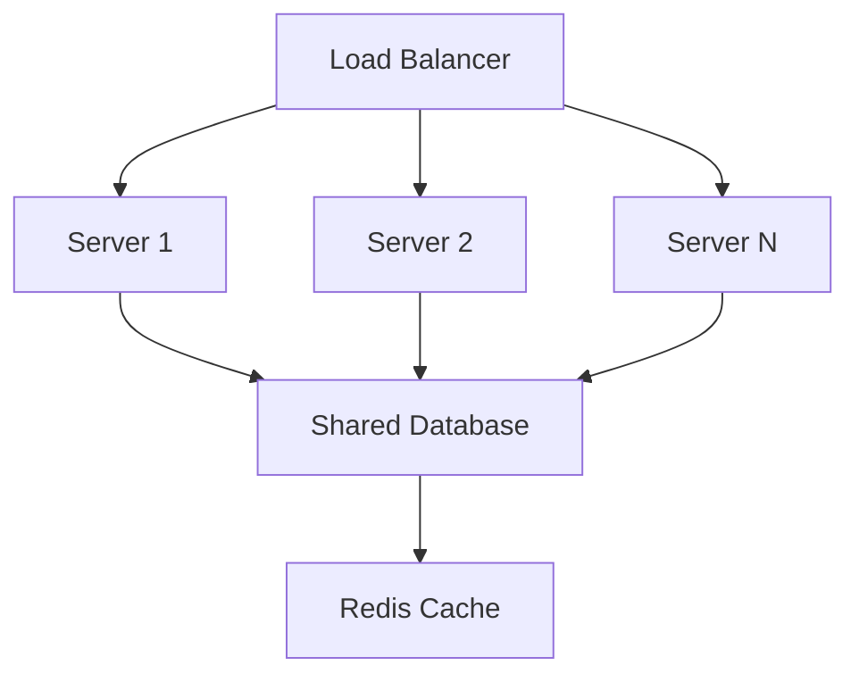
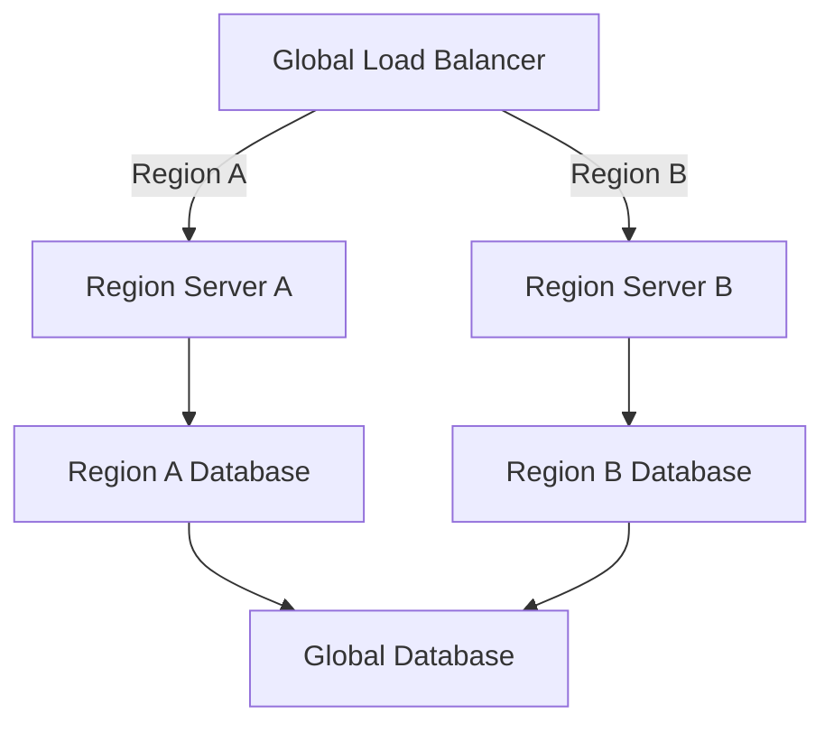

# Operations Guide

This directory contains documentation for deployment, configuration, and operational procedures.

## Current Structure

```
operations/
└── README.md          # This file (operations overview)
```

## Deployment Architecture

### Production Stack


### Development Stack


## Getting Started

### Prerequisites
- Docker 20.10+
- Docker Compose v2+
- 2GB+ RAM (4GB recommended)
- 2+ CPU cores
- 10GB+ disk space

### Quickstart

```bash
# Clone repository
git clone https://github.com/your-repo/kkmypk.git
cd kkmypk

# Copy environment template
cp .env.example .env

# Build and start services
docker compose up --build
```

### Environment Variables

Create `.env.example` file with:

```env
# Server Configuration
SERVER_HOST=0.0.0.0
SERVER_PORT=8080
SERVER_WS_PORT=8081
SERVER_ENV=development

# Database Configuration
DB_HOST=postgres
DB_PORT=5432
DB_NAME=game_db
DB_USER=game_user
DB_PASSWORD=secure_password
DB_SSL=false

# Game Configuration
GAME_TICK_RATE=20
GAME_MAX_PLAYERS=50
GAME_WORLD_SIZE=2000

# Security
JWT_SECRET=your_very_secure_random_string_here
JWT_EXPIRES_IN=24h
RATE_LIMIT_WINDOW=60
RATE_LIMIT_MAX=100

# Logging
LOG_LEVEL=info
LOG_FORMAT=json
```

## Docker Compose Configuration

### Basic `docker-compose.yml`

```yaml
version: '3.8'

services:
  rust-server:
    build:
      context: .
      dockerfile: Dockerfile
    ports:
      - "${SERVER_PORT}:${SERVER_PORT}"
      - "${SERVER_WS_PORT}:${SERVER_WS_PORT}"
    environment:
      - SERVER_HOST=${SERVER_HOST}
      - SERVER_PORT=${SERVER_PORT}
      - SERVER_WS_PORT=${SERVER_WS_PORT}
      - SERVER_ENV=${SERVER_ENV}
      - DB_HOST=${DB_HOST}
      - DB_PORT=${DB_PORT}
      - DB_NAME=${DB_NAME}
      - DB_USER=${DB_USER}
      - DB_PASSWORD=${DB_PASSWORD}
      - GAME_TICK_RATE=${GAME_TICK_RATE}
      - GAME_MAX_PLAYERS=${GAME_MAX_PLAYERS}
      - JWT_SECRET=${JWT_SECRET}
      - LOG_LEVEL=${LOG_LEVEL}
    depends_on:
      postgres:
        condition: service_healthy
    restart: unless-stopped
    healthcheck:
      test: ["CMD", "curl", "-f", "http://localhost:${SERVER_PORT}/health"]
      interval: 30s
      timeout: 10s
      retries: 3

  postgres:
    image: postgres:15-alpine
    environment:
      - POSTGRES_DB=${DB_NAME}
      - POSTGRES_USER=${DB_USER}
      - POSTGRES_PASSWORD=${DB_PASSWORD}
    ports:
      - "${DB_PORT}:${DB_PORT}"
    volumes:
      - postgres_data:/var/lib/postgresql/data
      - ./src/db/migrations:/docker-entrypoint-initdb.d
    healthcheck:
      test: ["CMD-SHELL", "pg_isready -U ${DB_USER} -d ${DB_NAME}"]
      interval: 5s
      timeout: 5s
      retries: 5
    restart: unless-stopped

volumes:
  postgres_data:
```

## Build Process

### Development Build

```bash
# Build with hot-reload for development
docker compose -f docker-compose.yml -f docker-compose.dev.yml up --build
```

### Production Build

```bash
# Build optimized production image
docker compose -f docker-compose.yml -f docker-compose.prod.yml build

# Start production services
docker compose -f docker-compose.yml -f docker-compose.prod.yml up -d
```

### Multi-stage Dockerfile

```dockerfile
# Stage 1: Build frontend assets
FROM node:18-alpine as builder
WORKDIR /app
COPY src/client/package*.json ./
RUN npm install
COPY src/client ./
RUN npm run build

# Stage 2: Build Rust server
FROM rust:1.70 as rust-builder
WORKDIR /app
COPY . ./
RUN cargo build --release

# Stage 3: Final image
FROM debian:bullseye-slim
WORKDIR /app

# Install runtime dependencies
RUN apt-get update && apt-get install -y \
    libssl1.1 \
    ca-certificates \
    && rm -rf /var/lib/apt/lists/*

# Copy built assets
COPY --from=builder /app/dist /app/static
COPY --from=rust-builder /app/target/release/server /app/server

# Copy configuration
COPY .env ./
COPY docker-entrypoint.sh /entrypoint.sh
RUN chmod +x /entrypoint.sh

EXPOSE 8080 8081
ENTRYPOINT ["/entrypoint.sh"]
```

## Configuration Management

### Configuration Files

```
config/
├── server.toml          # Main server configuration
├── game.toml            # Gameplay configuration
├── logging.toml         # Logging configuration
└── security.toml         # Security settings
```

### Configuration Structure

```toml
# server.toml
[server]
host = "0.0.0.0"
port = 8080
ws_port = 8081
environment = "production"
max_connections = 1000

[database]
host = "postgres"
port = 5432
name = "game_db"
user = "game_user"
password = "secure_password"
ssl = false
pool_size = 20

[cors]
allowed_origins = ["https://yourdomain.com", "https://www.yourdomain.com"]
allowed_methods = ["GET", "POST", "OPTIONS"]
allowed_headers = ["Content-Type", "Authorization"]
```

## Database Management

### Database Schema

```sql
-- Core tables
CREATE TABLE players (
  id UUID PRIMARY KEY,
  username VARCHAR(32) UNIQUE NOT NULL,
  email VARCHAR(255) UNIQUE,
  password_hash VARCHAR(255),
  created_at TIMESTAMP WITH TIME ZONE DEFAULT NOW(),
  last_login TIMESTAMP WITH TIME ZONE,
  is_banned BOOLEAN DEFAULT FALSE,
  ban_reason TEXT,
  ban_expires TIMESTAMP WITH TIME ZONE
);

CREATE TABLE sessions (
  id UUID PRIMARY KEY,
  player_id UUID REFERENCES players(id) ON DELETE CASCADE,
  token_hash VARCHAR(255) NOT NULL,
  created_at TIMESTAMP WITH TIME ZONE DEFAULT NOW(),
  expires_at TIMESTAMP WITH TIME ZONE NOT NULL,
  ip_address VARCHAR(45),
  user_agent TEXT
);

CREATE TABLE player_progress (
  player_id UUID PRIMARY KEY REFERENCES players(id) ON DELETE CASCADE,
  level INTEGER DEFAULT 1,
  experience INTEGER DEFAULT 0,
  last_position POINT,
  health REAL DEFAULT 100.0,
  hunger REAL DEFAULT 100.0,
  thirst REAL DEFAULT 100.0,
  inventory JSONB DEFAULT '[]'::jsonb,
  equipment JSONB DEFAULT '{}'::jsonb,
  skills JSONB DEFAULT '{}'::jsonb,
  statistics JSONB DEFAULT '{}'::jsonb,
  updated_at TIMESTAMP WITH TIME ZONE DEFAULT NOW()
);

-- Indexes for performance
CREATE INDEX idx_sessions_expires_at ON sessions(expires_at);
CREATE INDEX idx_sessions_token_hash ON sessions(token_hash);
CREATE INDEX idx_player_progress_level ON player_progress(level);
```

### Database Migrations

```bash
# Create new migration
# Use a tool like diesel, sqlx, or custom migration system

# Example migration file: src/db/migrations/001_initial_schema.sql
-- Up migration
CREATE TABLE IF NOT EXISTS players (...);
CREATE TABLE IF NOT EXISTS sessions (...);

-- Down migration  
DROP TABLE IF EXISTS sessions;
DROP TABLE IF EXISTS players;
```

### Backup and Restore

```bash
# Manual backup
pg_dump -h localhost -U game_user -d game_db -F c -f backup_$(date +%Y%m%d_%H%M%S).dump

# Scheduled backup (cron)
0 2 * * * pg_dump -h localhost -U game_user -d game_db -F c -f /backups/game_db_$(date +%Y%m%d).dump

# Restore
pg_restore -h localhost -U game_user -d game_db -c backup_file.dump
```

## Monitoring and Logging

### Logging Configuration

```toml
# logging.toml
[logging]
level = "info"
format = "json"
file = "/var/log/game/server.log"
max_size = "100MB"
max_files = 10

[metrics]
enabled = true
port = 9090
path = "/metrics"

[tracing]
enabled = true
sampling_rate = 0.1
jaeger_endpoint = "http://jaeger:14268/api/traces"
```

### Health Checks

```rust
// Example health check endpoint
#[get("/health")]
async fn health_check() -> HttpResponse {
    HttpResponse::Ok().json(json!({
        "status": "healthy",
        "timestamp": Utc::now(),
        "version": env!("CARGO_PKG_VERSION"),
        "players_online": get_online_players_count(),
        "server_tick": get_current_server_tick()
    }))
}
```

### Metrics Endpoint

```rust
#[get("/metrics")]
async fn metrics() -> HttpResponse {
    let metrics = get_metrics();
    HttpResponse::Ok().content_type("text/plain").body(metrics)
}
```

## Security Operations

### Authentication Flow



### Rate Limiting

```rust
// Example rate limiting middleware
async fn rate_limit_middleware(
    req: ServiceRequest,
    next: Next,
) -> Result<ServiceResponse, Error> {
    let client_ip = req.connection_info().realip_remote_addr();
    
    let mut rate_limiter = req.app_data::<web::Data<RateLimiter>>().unwrap();
    let limit = rate_limiter.check_limit(&client_ip).await;
    
    match limit {
        Ok(_) => next.call(req).await,
        Err(_) => Ok(ServiceResponse::new(
            req.into_response(HttpResponse::TooManyRequests().finish())
        )),
    }
}
```

### Security Headers

```rust
// Security middleware
async fn security_headers_middleware(
    req: ServiceRequest,
    next: Next,
) -> Result<ServiceResponse, Error> {
    let mut response = next.call(req).await?;
    
    response.headers_mut().insert(
        header::CONTENT_SECURITY_POLICY,
        HeaderValue::from_static("default-src 'self'")
    );
    
    response.headers_mut().insert(
        header::X_CONTENT_TYPE_OPTIONS,
        HeaderValue::from_static("nosniff")
    );
    
    response.headers_mut().insert(
        header::X_FRAME_OPTIONS,
        HeaderValue::from_static("DENY")
    );
    
    Ok(response)
}
```

## Performance Tuning

### Server Optimization

```toml
# performance.toml
[server]
worker_threads = 4
max_connections = 1000
connection_timeout = 30
keep_alive = 60

[simulation]
tick_rate = 20
max_entities_per_tick = 1000
physics_iterations = 8

[network]
max_message_size = 8192
compression_threshold = 1024
ping_interval = 30
pong_timeout = 10

[database]
connection_pool_size = 20
query_timeout = 5
max_retries = 3
```

### Performance Monitoring

```bash
# CPU and memory monitoring
top -c
htop

# Network monitoring
iftop
nethogs

# Database monitoring
pg_top
pg_stat_activity
```

## Scaling Strategies

### Vertical Scaling
- Increase CPU cores
- Add more RAM
- Use faster storage (SSD/NVMe)
- Optimize database queries

### Horizontal Scaling



### Region-Based Sharding



## Deployment Procedures

### Development Deployment

```bash
# Start development environment
docker compose -f docker-compose.yml -f docker-compose.dev.yml up --build

# With hot reload
docker compose -f docker-compose.yml -f docker-compose.dev.yml up --build --force-recreate
```

### Staging Deployment

```bash
# Build and tag staging image
docker compose -f docker-compose.yml -f docker-compose.staging.yml build

# Push to registry
docker tag game-server:staging your-registry/game-server:staging
docker push your-registry/game-server:staging

# Deploy to staging
docker stack deploy -c docker-compose.staging.yml game-staging
```

### Production Deployment

```bash
# Zero-downtime deployment

# 1. Build new image
docker compose -f docker-compose.yml -f docker-compose.prod.yml build

# 2. Push to registry
docker tag game-server:prod your-registry/game-server:prod-v1.2.3
docker push your-registry/game-server:prod-v1.2.3

# 3. Update service
kubectl set image deployment/game-server game-server=your-registry/game-server:prod-v1.2.3

# 4. Verify health
kubectl rollout status deployment/game-server

# 5. Monitor
kubectl logs -f deployment/game-server
```

## Troubleshooting

### Common Issues

#### Connection Problems
- **Symptom**: Clients cannot connect
- **Checks**:
  - `docker ps` - Are containers running?
  - `docker logs rust-server` - Any startup errors?
  - `netstat -tuln` - Are ports listening?
  - `ping postgres` - Can server reach database?

#### Performance Issues
- **Symptom**: Lag or slow response
- **Checks**:
  - `top` - High CPU usage?
  - `free -m` - Memory pressure?
  - `iotop` - Disk I/O bottlenecks?
  - `pg_stat_activity` - Slow database queries?

#### Database Problems
- **Symptom**: Database connection errors
- **Checks**:
  - `docker logs postgres` - Database errors?
  - `pg_isready` - Database ready?
  - `df -h` - Disk space available?
  - `pg_stat_database` - Database performance?

### Debugging Commands

```bash
# Check container status
docker ps -a

# View logs
docker logs rust-server --tail 100
docker logs postgres --tail 100

# Enter container for debugging
docker exec -it rust-server bash

# Database connection test
psql -h postgres -U game_user -d game_db

# Network connectivity test
ping postgres
nc -zv postgres 5432
```

## Maintenance Procedures

### Regular Maintenance

```bash
# Database maintenance
VACUUM ANALYZE;
REINDEX DATABASE game_db;

# Log rotation
logrotate /etc/logrotate.d/game-server

# Backup verification
pg_restore --verify -d game_db backup_file.dump
```

### Update Procedures

```bash
# Update dependencies
cargo update
npm update

# Security updates
docker pull postgres:15-alpine
apt-get update && apt-get upgrade

# Migration process
1. Backup database
2. Apply schema migrations
3. Update server code
4. Test thoroughly
5. Monitor after deployment
```

## Monitoring Setup

### Prometheus Configuration

```yaml
# prometheus.yml
scrape_configs:
  - job_name: 'game-server'
    static_configs:
      - targets: ['localhost:9090']
  
  - job_name: 'postgres'
    static_configs:
      - targets: ['postgres:5432']
```

### Grafana Dashboards

```json
{
  "title": "Game Server Dashboard",
  "panels": [
    {
      "title": "Players Online",
      "type": "graph",
      "targets": [
        {
          "expr": "game_players_online",
          "legendFormat": "Online Players"
        }
      ]
    },
    {
      "title": "Server Performance",
      "type": "graph",
      "targets": [
        {
          "expr": "rate(game_tick_duration_seconds[1m])",
          "legendFormat": "Tick Duration"
        }
      ]
    }
  ]
}
```

## CI/CD Pipeline

### GitHub Actions Example

```yaml
name: CI/CD Pipeline

on:
  push:
    branches: [ main ]
  pull_request:
    branches: [ main ]

jobs:
  test:
    runs-on: ubuntu-latest
    steps:
      - uses: actions/checkout@v3
      
      - name: Set up Rust
        uses: actions-rs/toolchain@v1
        with:
          toolchain: stable
          override: true
      
      - name: Run tests
        run: cargo test
      
      - name: Check formatting
        run: cargo fmt --check
      
      - name: Run clippy
        run: cargo clippy -- -D warnings

  build:
    needs: test
    runs-on: ubuntu-latest
    steps:
      - uses: actions/checkout@v3
      
      - name: Build Docker image
        run: docker build -t game-server .
      
      - name: Push to registry
        if: github.ref == 'refs/heads/main'
        run: |
          echo "${{ secrets.DOCKER_PASSWORD }}" | docker login -u "${{ secrets.DOCKER_USERNAME }}" --password-stdin
          docker tag game-server your-registry/game-server:${{ github.sha }}
          docker push your-registry/game-server:${{ github.sha }}
```

## Disaster Recovery

### Recovery Procedures

```bash
# Database corruption recovery
1. Stop all services
2. Restore from latest backup
3. Replay transaction logs if available
4. Verify data integrity
5. Restart services

# Server failure recovery
1. Identify failed component
2. Restart container/service
3. If persistent, roll back to previous version
4. Investigate root cause
5. Apply fix and redeploy
```

### Backup Strategy

```
Daily:
- Full database backup
- Retention: 7 days

Weekly:
- Full system snapshot
- Retention: 4 weeks

Monthly:
- Archive backup
- Retention: 12 months
```

## Related Documentation

- **Architecture Overview**: See `../architecture/README.md`
- **Protocol Specifications**: See `../protocol/README.md`
- **Gameplay Systems**: See `../gameplay/README.md`