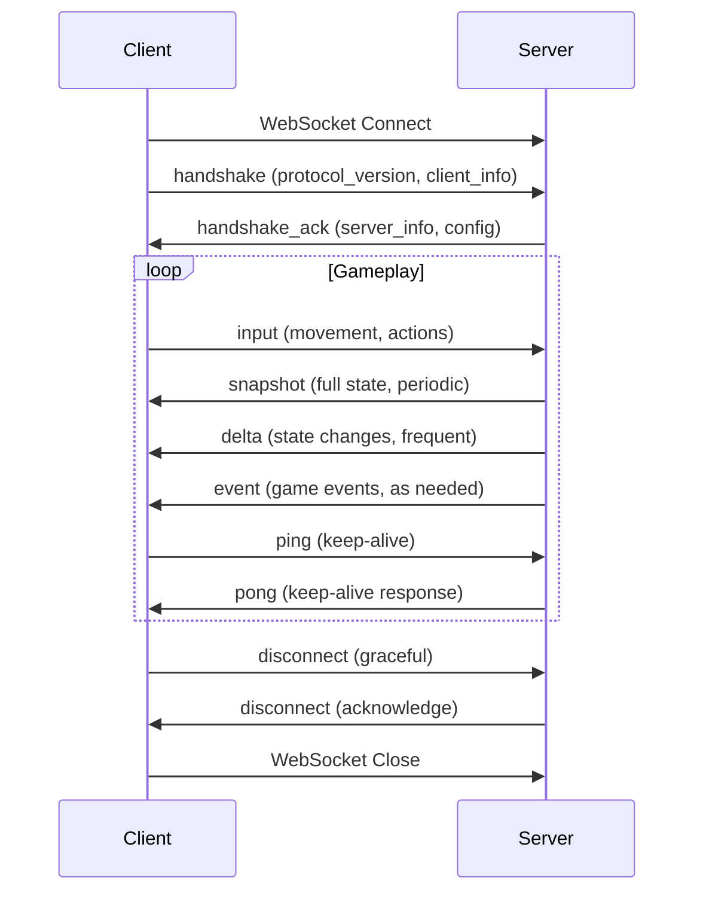

# Network Protocol

This directory contains specifications for the network communication protocol.

## Current Structure

```
protocol/
└── README.md          # This file (protocol overview)
```

## Protocol Overview

### Transport Layer
- **Primary Transport**: WebSocket (ws:// or wss://)
- **Fallback Transport**: HTTP for initial handshake and static assets
- **Port Configuration**: Configurable, typically 80/443 for HTTP, same or different for WS

### Message Format

#### Common Message Structure
All messages share this base structure:

```typescript
interface BaseMessage {
  protocol_version: string;  // Semantic version (e.g., "1.0.0")
  msg_type: string;         // Message type identifier
  seq: number;              // Sequence number (client input counter)
  timestamp?: number;       // Optional client timestamp (ms since epoch)
}
```

#### Message Types

| Type | Direction | Description |
|------|-----------|-------------|
| `handshake` | Client → Server | Initial connection handshake |
| `handshake_ack` | Server → Client | Handshake acknowledgment |
| `input` | Client → Server | Player input commands |
| `snapshot` | Server → Client | Full game state snapshot |
| `delta` | Server → Client | State changes since last snapshot |
| `event` | Server → Client | Game events (chat, notifications) |
| `ping` | Bidirectional | Keep-alive and latency measurement |
| `pong` | Bidirectional | Response to ping |
| `error` | Server → Client | Error notification |
| `disconnect` | Bidirectional | Graceful disconnect |

### Handshake Protocol

#### Client → Server Handshake
```typescript
interface HandshakeMessage extends BaseMessage {
  msg_type: "handshake";
  client_info: {
    version: string;      // Client version
    platform: string;     // Browser/OS info
    screen: {             // Optional client capabilities
      width: number;
      height: number;
    };
    auth_token?: string; // If resuming session
  };
}
```

#### Server → Client Handshake Response
```typescript
interface HandshakeAckMessage extends BaseMessage {
  msg_type: "handshake_ack";
  server_info: {
    version: string;      // Server protocol version
    tick_rate: number;    // Simulation tick rate (Hz)
    game_time: number;    // Current server game time
    session_id: string;   // New/validated session ID
    player_id?: string;   // Assigned player ID (if authenticated)
  };
  config: {
    // Game configuration parameters
    movement_speed: number;
    crafting_enabled: boolean;
    // ... other config options
  };
}
```

### Input Protocol

#### Client Input Message
```typescript
interface InputMessage extends BaseMessage {
  msg_type: "input";
  inputs: {
    movement?: {
      x: number;           // -1 to 1 (left/right)
      y: number;           // -1 to 1 (up/down)
      sprint: boolean;     // Sprint modifier
    };
    actions?: {
      primary: boolean;    // Primary action (attack/use)
      secondary: boolean;  // Secondary action
      interact: boolean;   // Interact with objects
      inventory: boolean;  // Open inventory
      crafting: boolean;   // Open crafting
      // ... other action types
    };
    cursor?: {
      x: number;           // World/screen coordinates
      y: number;
      action: string;      // "click", "right_click", etc.
    };
    chat?: string;        // Chat message (if entered)
    // ... other input types
  };
  client_time: number;   // Client timestamp for input
}
```

### Snapshot Protocol

#### Full State Snapshot
```typescript
interface SnapshotMessage extends BaseMessage {
  msg_type: "snapshot";
  server_tick: number;   // Server tick counter
  game_time: number;     // Total game time elapsed
  players: Array<{
    id: string;
    position: { x: number; y: number };
    velocity: { x: number; y: number };
    health: number;
    hunger: number;
    thirst: number;
    stamina: number;
    inventory: Array<{
      item_id: string;
      quantity: number;
      equipped: boolean;
    }>;
    // ... other player state
  }>;
  world: {
    resources: Array<{
      id: string;
      type: string;        // "tree", "rock", "bush", etc.
      position: { x: number; y: number };
      state: number;       // Health/amount remaining
      respawn_time?: number; // If applicable
    }>;
    structures: Array<{
      id: string;
      type: string;
      position: { x: number; y: number };
      health: number;
      owner_id?: string;
      // ... structure-specific data
    }>;
    // ... other world state
  };
  // ... other game state
}
```

#### Delta Update
```typescript
interface DeltaMessage extends BaseMessage {
  msg_type: "delta";
  server_tick: number;   // Server tick counter
  base_tick: number;     // Tick this delta is based on
  player_updates: Array<{
    id: string;
    position?: { x: number; y: number };
    velocity?: { x: number; y: number };
    health?: number;
    // ... only changed properties
  }>;
  world_updates: {
    resources_created?: Array<Resource>;
    resources_updated?: Array<Partial<Resource>>;
    resources_destroyed?: Array<string>; // IDs
    // ... similar for other world entities
  };
  events?: Array<GameEvent>; // Recent game events
}
```

### Event Protocol

```typescript
interface EventMessage extends BaseMessage {
  msg_type: "event";
  events: Array<{
    type: string;         // "chat", "combat", "crafting", etc.
    timestamp: number;    // Server timestamp
    data: any;            // Event-specific data
    // Example chat event:
    // { type: "chat", sender: "player1", message: "Hello!", channel: "global" }
    // Example combat event:
    // { type: "combat", attacker: "player1", target: "player2", damage: 10, weapon: "sword" }
  }>;
}
```

### Error Protocol

```typescript
interface ErrorMessage extends BaseMessage {
  msg_type: "error";
  code: number;          // Error code
  message: string;       // Human-readable message
  details?: any;         // Additional error details
  severity: "warn" | "error" | "fatal"; // Severity level
}
```

## Serialization

### Format Options
1. **Binary Protocol (Preferred)**
   - Custom binary format for efficiency
   - Fixed-size headers, variable payloads
   - Little-endian byte order
   - Schema versioned

2. **JSON Protocol (Fallback)**
   - Compact JSON with no whitespace
   - Field order not guaranteed
   - UTF-8 encoding

### Binary Format Specification

```
Message Header (12 bytes):
- 4 bytes: Magic number (0x53544152 = "STAR")
- 2 bytes: Protocol version (major.minor)
- 1 byte: Message type ID
- 4 bytes: Message length (including header)
- 1 byte: Flags (compression, encryption, etc.)

Message Payload:
- Variable length based on message type
- Field-specific serialization rules
- String fields: length-prefixed UTF-8
- Numeric fields: native binary representation
```

## Message Flow

### Typical Connection Lifecycle



## Rate Limiting and Abuse Prevention

### Input Rate Limits
- **Maximum Input Rate**: 60 inputs per second per client
- **Burst Limit**: 100 inputs in any 1-second window
- **Violation Handling**: Immediate disconnect with error code

### Message Size Limits
- **Maximum Message Size**: 8KB for most messages
- **Snapshot Limit**: 32KB (configurable)
- **Oversize Handling**: Connection termination

### Connection Management
- **Ping Interval**: 30 seconds
- **Pong Timeout**: 10 seconds
- **Inactivity Timeout**: 60 seconds without any message

## Versioning and Compatibility

### Protocol Versioning
- **Semantic Versioning**: MAJOR.MINOR.PATCH
- **Backward Compatibility**: MINOR version changes should be backward compatible
- **Breaking Changes**: MAJOR version changes may break compatibility

### Version Negotiation
1. Client connects with supported protocol versions
2. Server selects highest compatible version
3. Server responds with selected version in handshake_ack
4. Client must use negotiated version for all subsequent messages

### Migration Strategy
- **Deprecation Period**: Support old versions for at least one release cycle
- **Fallback Behavior**: Graceful degradation where possible
- **Error Handling**: Clear error messages for version mismatches

## Security Considerations

### Authentication
- **Session Tokens**: HTTP-only cookies or bearer tokens
- **Token Rotation**: Regular token rotation for active sessions
- **Token Invalidation**: Immediate invalidation on suspicious activity

### Message Validation
- **Schema Validation**: Validate all message structures
- **Bounds Checking**: Ensure numeric values are within expected ranges
- **Rate Limiting**: Enforce per-client message rate limits
- **Input Sanitization**: Clean all string inputs

### Encryption
- **Transport Security**: TLS for all production connections (wss://)
- **Message Integrity**: Consider message signing for critical operations
- **Sensitive Data**: Never transmit secrets in client-accessible messages

## Testing and Validation

### Protocol Testing
- **Unit Tests**: Message serialization/deserialization
- **Integration Tests**: End-to-end message flows
- **Stress Tests**: High message volume scenarios
- **Compatibility Tests**: Version negotiation and fallback

### Test Coverage Requirements
- All message types must have serialization tests
- Version negotiation must be thoroughly tested
- Rate limiting must be validated under load
- Error conditions must be tested

## Implementation Notes

### Rust Server Implementation
- Use `tokio` for async WebSocket handling
- Use `serde` for JSON serialization (if using JSON protocol)
- Implement custom binary protocol for production
- Use `tracing` for protocol-level logging

### TypeScript Client Implementation
- Use browser-native WebSocket API
- Implement message queue for reliable ordering
- Handle connection state changes gracefully
- Provide hooks for game logic to respond to messages

## Future Protocol Enhancements

### Potential Additions
1. **Message Compression**: For large snapshots
2. **Message Prioritization**: Critical vs. non-critical messages
3. **Reliable Message Delivery**: Acknowledgment protocol for important messages
4. **Encrypted Payloads**: End-to-end encryption for sensitive operations
5. **Protocol Extensions**: Plugin architecture for custom message types

### Non-Goals (Current Phase)
1. **Perfect Reliability**: Basic error handling sufficient
2. **Complex Encryption**: Transport-level TLS sufficient
3. **Extensive Compression**: Simple protocol sufficient initially
4. **Backward Compatibility**: Breaking changes allowed during development

## Related Documentation

- **Architecture Overview**: See `../architecture/README.md`
- **Gameplay Systems**: See `../gameplay/README.md`
- **Operational Setup**: See `../operations/README.md`