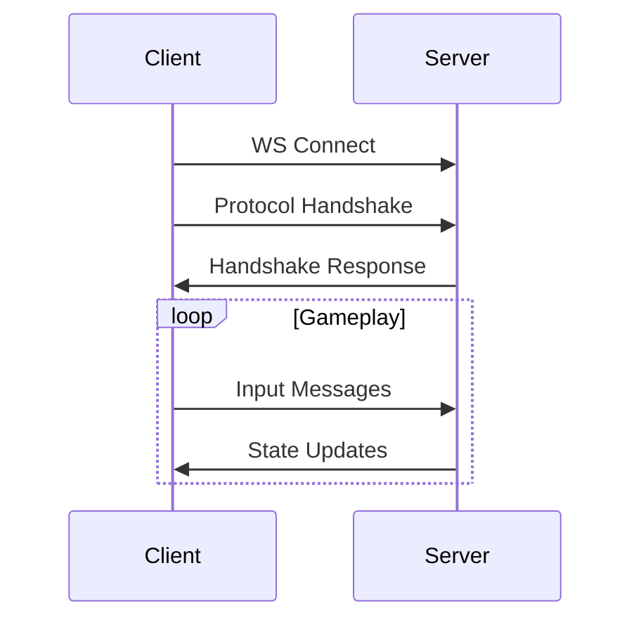

# Transport Layer Protocol

## WebSocket Transport

### Connection Establishment
- Standard WebSocket handshake
- Protocol version negotiation
- Authentication exchange

### Message Flow

### Connection Management
- Automatic reconnection
- Heartbeat/ping mechanism
- Graceful disconnection

## HTTP Transport

### Endpoints
- `/api/login` - Authentication
- `/api/status` - Server status
- `/static/*` - Asset delivery

### Headers
- `Content-Type: application/json`
- `Authorization: Bearer <token>`
- `X-Protocol-Version: 1.0.0`

## Performance Optimization

### Connection Pooling
- Reuse WebSocket connections
- Minimize reconnection overhead
- Connection state management

### Message Batching
- Combine multiple inputs
- Reduce network round trips
- Optimize small messages
