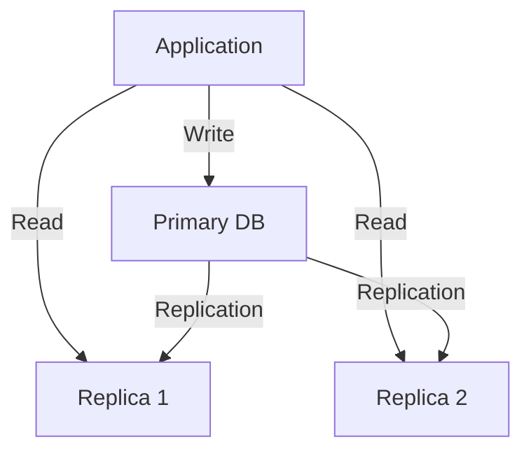

# Database

PostgreSQL database schema, migrations, and utilities.

## Structure

```
db/
├── README.md              # This file
├── migrations/            # Database migration scripts
│   ├── 001_initial_schema.sql
│   ├── 002_add_player_progress.sql
│   └── ...
├── seeds/                 # Seed data
│   ├── development/       # Development seed data
│   └── production/        # Production seed data
├── schema/                # Schema documentation
│   ├── tables/            # Table definitions
│   ├── views/             # View definitions
│   ├── functions/         # Function definitions
│   └── triggers/          # Trigger definitions
├── queries/               # Common query utilities
│   ├── players.sql        # Player-related queries
│   ├── world.sql          # World-related queries
│   └── ...
├── scripts/               # Database scripts
│   ├── backup.sh          # Backup script
│   ├── restore.sh         # Restore script
│   └── analyze.sh         # Analysis script
└── docs/                  # Database documentation
    ├── er-diagram.png     # Entity-relationship diagram
    └── data-model.md      # Data model documentation
```

## Database Setup

### Prerequisites
- PostgreSQL 15+
- psql client
- Optional: pgAdmin or other GUI tools

### Initial Setup

```bash
# Create database
createdb game_db

# Create user
createuser --pwprompt game_user

# Grant permissions
psql -d game_db -c "GRANT ALL PRIVILEGES ON DATABASE game_db TO game_user;"
psql -d game_db -c "GRANT ALL PRIVILEGES ON ALL TABLES IN SCHEMA public TO game_user;"
psql -d game_db -c "GRANT ALL PRIVILEGES ON ALL SEQUENCES IN SCHEMA public TO game_user;"
```

### Docker Setup

```yaml
# docker-compose.yml snippet
services:
  postgres:
    image: postgres:15-alpine
    environment:
      POSTGRES_DB: game_db
      POSTGRES_USER: game_user
      POSTGRES_PASSWORD: secure_password
    ports:
      - "5432:5432"
    volumes:
      - postgres_data:/var/lib/postgresql/data
      - ./src/db/migrations:/docker-entrypoint-initdb.d
    healthcheck:
      test: ["CMD-SHELL", "pg_isready -U game_user -d game_db"]
      interval: 5s
      timeout: 5s
      retries: 5

volumes:
  postgres_data:
```

## Migration System

### Migration Structure

```sql
-- Example migration: 001_initial_schema.sql

-- Up migration (applied when migrating forward)
CREATE TABLE IF NOT EXISTS players (
    id UUID PRIMARY KEY,
    username VARCHAR(32) UNIQUE NOT NULL,
    email VARCHAR(255) UNIQUE,
    password_hash VARCHAR(255) NOT NULL,
    created_at TIMESTAMP WITH TIME ZONE DEFAULT NOW(),
    last_login TIMESTAMP WITH TIME ZONE,
    is_banned BOOLEAN DEFAULT FALSE,
    ban_reason TEXT,
    ban_expires TIMESTAMP WITH TIME ZONE
);

CREATE TABLE IF NOT EXISTS sessions (
    id UUID PRIMARY KEY,
    player_id UUID REFERENCES players(id) ON DELETE CASCADE,
    token_hash VARCHAR(255) NOT NULL,
    created_at TIMESTAMP WITH TIME ZONE DEFAULT NOW(),
    expires_at TIMESTAMP WITH TIME ZONE NOT NULL,
    ip_address VARCHAR(45),
    user_agent TEXT
);

-- Indexes
CREATE INDEX IF NOT EXISTS idx_sessions_expires_at ON sessions(expires_at);
CREATE INDEX IF NOT EXISTS idx_sessions_token_hash ON sessions(token_hash);

-- Down migration (applied when rolling back)
DROP TABLE IF EXISTS sessions;
DROP TABLE IF EXISTS players;
```

### Migration Management

```bash
# Apply migrations manually
psql -U game_user -d game_db -f migrations/001_initial_schema.sql

# Using a migration tool (example with node-pg-migrate)
npx pg-migrate up

# Rollback migrations
npx pg-migrate down

# Create new migration
npx pg-migrate create add_player_inventory
```

## Schema Design

### Core Tables

#### Players
```sql
CREATE TABLE players (
    id UUID PRIMARY KEY,
    username VARCHAR(32) UNIQUE NOT NULL,
    email VARCHAR(255) UNIQUE,
    password_hash VARCHAR(255) NOT NULL,
    created_at TIMESTAMP WITH TIME ZONE DEFAULT NOW(),
    last_login TIMESTAMP WITH TIME ZONE,
    is_banned BOOLEAN DEFAULT FALSE,
    ban_reason TEXT,
    ban_expires TIMESTAMP WITH TIME ZONE,
    CONSTRAINT valid_username CHECK (username ~ '^[a-zA-Z0-9_]{3,32}$')
);
```

#### Player Progress
```sql
CREATE TABLE player_progress (
    player_id UUID PRIMARY KEY REFERENCES players(id) ON DELETE CASCADE,
    level INTEGER DEFAULT 1 CHECK (level >= 1),
    experience BIGINT DEFAULT 0 CHECK (experience >= 0),
    last_position POINT,
    health REAL DEFAULT 100.0 CHECK (health BETWEEN 0 AND 100),
    hunger REAL DEFAULT 100.0 CHECK (hunger BETWEEN 0 AND 100),
    thirst REAL DEFAULT 100.0 CHECK (thirst BETWEEN 0 AND 100),
    inventory JSONB DEFAULT '[]'::jsonb,
    equipment JSONB DEFAULT '{}'::jsonb,
    skills JSONB DEFAULT '{}'::jsonb,
    statistics JSONB DEFAULT '{}'::jsonb,
    updated_at TIMESTAMP WITH TIME ZONE DEFAULT NOW(),
    CONSTRAINT valid_inventory CHECK (
        jsonb_typeof(inventory) = 'array' OR inventory IS NULL
    )
);
```

#### Sessions
```sql
CREATE TABLE sessions (
    id UUID PRIMARY KEY,
    player_id UUID REFERENCES players(id) ON DELETE CASCADE,
    token_hash VARCHAR(255) NOT NULL,
    created_at TIMESTAMP WITH TIME ZONE DEFAULT NOW(),
    expires_at TIMESTAMP WITH TIME ZONE NOT NULL,
    ip_address VARCHAR(45),
    user_agent TEXT,
    is_revoked BOOLEAN DEFAULT FALSE,
    CONSTRAINT valid_expires CHECK (expires_at > NOW())
);
```

### Indexing Strategy

```sql
-- Performance-critical indexes
CREATE INDEX idx_player_progress_level ON player_progress(level);
CREATE INDEX idx_sessions_expires_at ON sessions(expires_at);
CREATE INDEX idx_sessions_token_hash ON sessions(token_hash);
CREATE INDEX idx_players_username ON players(username);
CREATE INDEX idx_players_email ON players(email);

-- Partial indexes
CREATE INDEX idx_sessions_active ON sessions(player_id) 
WHERE expires_at > NOW() AND is_revoked = FALSE;

-- GIN indexes for JSONB
CREATE INDEX idx_player_progress_inventory ON player_progress 
USING GIN (inventory jsonb_path_ops);
```

## Query Optimization

### Common Query Patterns

#### Player Login
```sql
-- Find player by username for authentication
SELECT id, username, password_hash, is_banned
FROM players
WHERE username = $1;

-- Create new session
INSERT INTO sessions (id, player_id, token_hash, expires_at, ip_address, user_agent)
VALUES ($1, $2, $3, NOW() + INTERVAL '24 hours', $4, $5)
RETURNING id, expires_at;
```

#### Player State Update
```sql
-- Update player progress
UPDATE player_progress
SET 
    level = $1,
    experience = $2,
    health = $3,
    hunger = $4,
    thirst = $5,
    inventory = $6,
    equipment = $7,
    skills = $8,
    statistics = $9,
    updated_at = NOW()
WHERE player_id = $10
RETURNING *;
```

#### Session Validation
```sql
-- Validate session token
SELECT s.id, s.player_id, s.expires_at, p.username
FROM sessions s
JOIN players p ON s.player_id = p.id
WHERE s.token_hash = $1
AND s.expires_at > NOW()
AND s.is_revoked = FALSE
AND p.is_banned = FALSE;
```

## Database Utilities

### Backup and Restore

```bash
# Full database backup
pg_dump -U game_user -d game_db -F c -f backup_$(date +%Y%m%d).dump

# Schema-only backup
pg_dump -U game_user -d game_db -F c -s -f schema_backup.dump

# Data-only backup
pg_dump -U game_user -d game_db -F c -a -f data_backup.dump

# Restore database
pg_restore -U game_user -d game_db -c -j 4 backup_file.dump

# Verify backup
pg_restore --verify -d game_db backup_file.dump
```

### Maintenance Commands

```bash
# Vacuum and analyze
VACUUM ANALYZE;

# Reindex database
REINDEX DATABASE game_db;

# Check for bloated tables
SELECT schemaname, tablename, pg_size_pretty(pg_total_relation_size(schemaname || '.' || tablename)) as size
FROM pg_tables
WHERE schemaname = 'public'
ORDER BY pg_total_relation_size(schemaname || '.' || tablename) DESC;

# Find long-running queries
SELECT pid, now() - query_start AS duration, query, state
FROM pg_stat_activity
WHERE state = 'active'
ORDER BY duration DESC;
```

## Performance Monitoring

### Key Metrics

```sql
-- Database size
SELECT pg_size_pretty(pg_database_size('game_db')) as database_size;

-- Table sizes
SELECT table_name, 
       pg_size_pretty(pg_total_relation_size(table_name)) as size,
       pg_size_pretty(pg_total_relation_size(table_name) - pg_relation_size(table_name)) as external_size
FROM information_schema.tables
WHERE table_schema = 'public'
ORDER BY pg_total_relation_size(table_name) DESC;

-- Index usage
SELECT schemaname, tablename, indexname, idx_scan, idx_tup_read, idx_tup_fetch
FROM pg_stat_user_indexes
ORDER BY idx_scan DESC;

-- Query performance
SELECT query, calls, total_exec_time, mean_exec_time
FROM pg_stat_statements
ORDER BY mean_exec_time DESC
LIMIT 10;
```

### Performance Tuning

```sql
-- Add missing indexes based on query patterns
CREATE INDEX IF NOT EXISTS idx_player_progress_updated_at 
ON player_progress(updated_at);

-- Analyze query performance
EXPLAIN ANALYZE 
SELECT * FROM player_progress 
WHERE level > 10 
ORDER BY experience DESC 
LIMIT 10;

-- Optimize JSONB queries
CREATE INDEX IF NOT EXISTS idx_player_progress_skills 
ON player_progress USING GIN (skills jsonb_path_ops);
```

## Security Practices

### Database Security

```sql
-- Create read-only user
CREATE USER game_reader WITH PASSWORD 'read_only_password';
GRANT CONNECT ON DATABASE game_db TO game_reader;
GRANT USAGE ON SCHEMA public TO game_reader;
GRANT SELECT ON ALL TABLES IN SCHEMA public TO game_reader;

-- Revoke excessive permissions
REVOKE CREATE ON SCHEMA public FROM game_user;
REVOKE ALL ON TABLE sensitive_data FROM game_user;

-- Audit logging
ALTER SYSTEM SET log_statement = 'all';
ALTER SYSTEM SET log_connections = 'on';
ALTER SYSTEM SET log_disconnections = 'on';
```

### Data Protection

```sql
-- Encrypt sensitive data
CREATE EXTENSION pgcrypto;

-- Store encrypted data
INSERT INTO sensitive_data (user_id, data)
VALUES ($1, pgp_sym_encrypt($2, 'secret_key'));

-- Retrieve decrypted data
SELECT pgp_sym_decrypt(data, 'secret_key') as decrypted_data
FROM sensitive_data
WHERE user_id = $1;
```

## Testing Strategy

### Test Data Setup

```bash
# Create test database
createdb game_test_db

# Load test schema
psql -d game_test_db -f migrations/*.sql

# Load test data
psql -d game_test_db -f seeds/development/*.sql
```

### Test Queries

```sql
-- Test player creation
INSERT INTO players (id, username, password_hash, email)
VALUES ('test-player-id', 'testuser', 'hashed_password', 'test@example.com')
RETURNING *;

-- Test session creation
INSERT INTO sessions (id, player_id, token_hash, expires_at)
VALUES ('test-session-id', 'test-player-id', 'token_hash', NOW() + INTERVAL '1 hour')
RETURNING *;

-- Test player progress
INSERT INTO player_progress (player_id, level, experience)
VALUES ('test-player-id', 1, 0)
RETURNING *;
```

## Scaling Considerations

### Read Replicas



### Connection Pooling

```rust
// Rust connection pool setup
let pool = PgPool::connect(&database_url)
    .await
    .expect("Failed to create pool");

// Configure pool size
let pool = PgPoolOptions::new()
    .max_connections(20)
    .min_connections(5)
    .connect(&database_url)
    .await
    .expect("Failed to create pool");
```

### Partitioning Strategy

```sql
-- Partition large tables by time
CREATE TABLE player_actions (
    id BIGSERIAL,
    player_id UUID,
    action_type VARCHAR(50),
    data JSONB,
    created_at TIMESTAMP WITH TIME ZONE NOT NULL
) PARTITION BY RANGE (created_at);

-- Create monthly partitions
CREATE TABLE player_actions_2023_01 PARTITION OF player_actions
    FOR VALUES FROM ('2023-01-01') TO ('2023-02-01');

CREATE TABLE player_actions_2023_02 PARTITION OF player_actions
    FOR VALUES FROM ('2023-02-01') TO ('2023-03-01');
```

## Future Enhancements

### Planned Improvements
1. **Performance**: Query optimization and indexing
2. **Scalability**: Read replica support
3. **Reliability**: Better backup strategies
4. **Monitoring**: Enhanced database metrics
5. **Security**: Improved data protection

### Technical Debt
- [ ] Add comprehensive test coverage
- [ ] Implement proper connection pooling
- [ ] Add query performance monitoring
- [ ] Document all stored procedures
- [ ] Create data dictionary

## Related Documentation

- **Architecture**: See `../../docs/architecture/README.md`
- **Protocol**: See `../../docs/protocol/README.md`
- **Gameplay**: See `../../docs/gameplay/README.md`
- **Operations**: See `../../docs/operations/README.md`